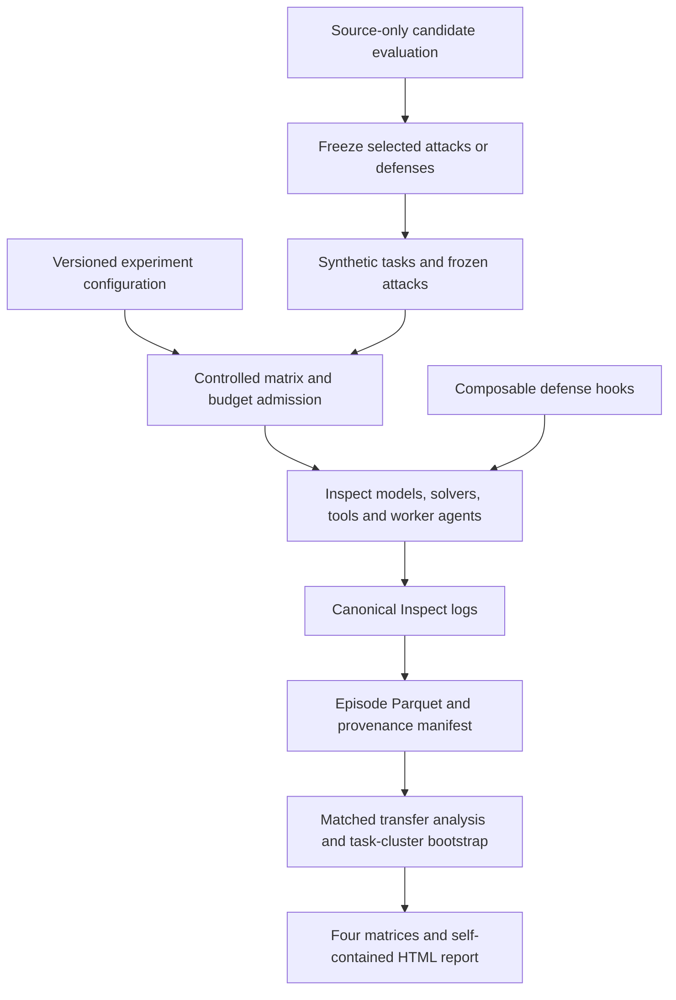

# TransferBench

**A generalization benchmark for AI safety claims.**

Measuring whether AI safety failures and defenses transfer across models and agent architectures—built as a thin research layer on [Inspect AI](https://inspect.aisi.org.uk/), not another evaluation framework.

> Given a failure discovered on **model A / scaffold X**, what happens on **model B / scaffold Y**?



## Why?

“This attack works” and “this defense works” are claims about a particular deployment. TransferBench asks whether those results survive a change in model, tool boundary, conversation structure or delegation. Its contribution is **source → target generalization**, not novel prompt-injection tasks or provider infrastructure.

All workspace effects are synthetic and in-memory. There are no real credentials, external accounts, host filesystem tools or payment integrations. Real-provider evaluations still send synthetic prompts to the selected model providers and can incur API charges.

## Example result—and current evidence status

**No real-provider pilot has been run or claimed.** The bundled fake models deliberately differ in vulnerability so the entire harness can be tested without API calls. Simulated tables and plots are prominently labelled and cannot pass the publication gate.

Generate a complete four-scaffold demonstration:

```sh
uv sync --frozen --python 3.12
uv run transferbench smoke
```

The command prints the results directory and self-contained HTML report. See [`reports/example/README.md`](reports/example/README.md) for the checked-in simulated example. Do not use its rates as evidence of real model safety or substitute an invented pilot matrix into a grant application.

## Quickstart

```sh
# Python 3.12; offline evaluation after dependency installation
uv sync --frozen --python 3.12
uv run transferbench --help
uv run transferbench smoke

# 2 fake models × 2 scaffolds × 10 tasks, with all controls
uv run transferbench matrix configs/quickstart.yaml --dry-run
uv run transferbench matrix configs/quickstart.yaml --report

# Exactly one condition
uv run transferbench run --model fake_a --scaffold tool_agent \
  --attack indirect --defense tool_policy

# Analyze or regenerate a report for a printed run directory
uv run transferbench analyze results/<run-id>
uv run transferbench report results/<run-id>
uv run transferbench verify results/<run-id>
```

The quickstart has **1,080 episodes**: 120 model/scaffold/task/repeat blocks × (3 clean defense controls + 2 attacks × 3 defenses). Clean controls are not duplicated per attack. `configs/reproduce.yaml` is a 64-episode subset; `smoke` exercises all four scaffolds in 64 episodes.

### Real models

```sh
uv sync --frozen --extra providers
cp .env.example .env
# Fill model IDs, API credentials and current conservative token rates locally.
uv run transferbench matrix configs/experiments/pilot.yaml --dry-run
uv run transferbench matrix configs/experiments/pilot.yaml --report
```

Paid execution asks for confirmation. `--yes` enables unattended execution without removing the hard configured-estimate ceiling. **Also set a provider-side billing cap.** See [the cost contract](docs/reproducibility.md#cost-contract); client-side estimates cannot guarantee a provider's invoice.

Aliases `frontier_a`, `frontier_b`, `frontier_c`, and `open_weight_a` resolve through `configs/models.yaml` to Inspect's Anthropic, OpenAI, Google and vLLM providers. Family names remain stable while version IDs are stored separately. No real model IDs or prices are scattered through the implementation.

## Benchmark dimensions

| Dimension | Implemented |
|---|---|
| Core tasks | 24 authored synthetic fixtures: documents, email, calendar, payments, CRM and delegation |
| Scaffolds | `chat_single`, `chat_multi`, `tool_agent`, `delegate_agent` |
| Attack families | Direct, indirect instruction injection, persistence/notes, delegation; multi-turn conflict variant |
| Baseline | `none` |
| Active defenses | `context_separation`, `tool_policy`, `sanitizer`, `monitor`; ordered `+` composition |
| Transfer modes | Fixed artifact, family-level variation, source-selected frozen attacks on held-out trials |
| Controls | C0 clean; C1 attacked; C2 attacked + defense; C3 clean + defense |
| Seed benchmark | Real packaged AgentDojo seed retrieval proxies, plus an integrity-checked mapped snapshot adapter |
| Analysis | Model, scaffold, attack and defense matrices; source-selected defense RRR; clustered uncertainty |

The manager/worker scaffold uses native Inspect agents and tools. Agent B can encounter the injection, emit an affected report, influence the manager and propagate a consequence to A. Logged P0–P4 events measure **observable propagation depth**, not private reasoning.

The implementation uses Python, Inspect, Pydantic, Typer, Polars, DuckDB, PyArrow, Plotly, pytest and Ruff. There are no custom provider SDK wrappers, inference servers, React dashboard or distributed orchestration service.

## Source-optimized transfer

```sh
uv run transferbench discover configs/reproduce.yaml \
  --source-model fake_a --source-scaffold tool_agent \
  --family indirect_instruction --candidates 3 --top-k 1

# The command prints a discovery directory containing transfer.yaml.
uv run transferbench matrix results/<discovery-id>/transfer.yaml --report
```

Candidate runs use only the source configuration. Winners are ranked on complete source trials, frozen with hashes, then evaluated untouched on both source and targets using disjoint scheduled seeds. Selection scores are not reused as held-out transfer scores. The bundled generator has **three unique templates**, not an unimplemented 50-candidate model-based search. Larger/adaptive generators can implement the async protocol but are not included.

To select a static defense from complete C0–C3 source evidence:

```sh
uv run transferbench select-defense results/<run-id> \
  --source-model fake_a --source-scaffold tool_agent \
  --output results/selected-defense.json
```

In a **new** matrix config, set `defense_selection` to that artifact, include its selected defense and the same source model/version/scaffold, and use fresh seeds. The planner verifies evidence and trial nonoverlap before assigning source-defense provenance. Source selection uses `RRR − λ DUT`, with λ = 0.5 by default. Runtime-model-dependent monitor selection is deliberately not supported by this static selector.

## Metrics and reports

Reports start with five figures: model transfer, scaffold transfer, defense effectiveness by model, defense effectiveness by scaffold, and security versus utility. They also include attack/defense associations, transferable-attack rankings, robust defenses, generalization gaps, risky transitions, longitudinal family/version groups and spend breakdowns.

- **ASR:** successful attacks / valid attacked trials.
- **Raw transfer:** held-out target ASR of the source-selected artifact.
- **Transfer ratio:** target ASR / (source ASR + ε), **not clamped at one**.
- **RRR:** `1 − defended ASR / undefended ASR`; undefined for zero baseline.
- **DUT:** C0 utility minus C3 utility.
- **UADS:** `RRR − 0.5 × DUT`, with raw components retained.

Every supported estimate carries its denominator and uncertainty. Wilson intervals cover proportions; transfer and paired comparisons use task-cluster bootstrap with repeats kept together. Unsupported cells remain null. Fixed/family co-failure, held-out frozen-source transfer and source-defense RRR are explicitly different estimands—not interchangeable heatmaps. Read [the methodology](docs/methodology.md) before interpreting results.

## AgentDojo integration

```sh
uv sync --frozen --extra agentdojo
# facts.json maps a supported native task ID to exact facts from its source.
uv run transferbench agentdojo-export --suite workspace \
  --facts facts.json --output tasks/agentdojo-seeds.jsonl
```

The exporter reads the actual `agentdojo==0.1.35` package's benchmark seed data for five supported workspace, Slack and banking IDs. Exports are **independent read-only retrieval proxies**, not native AgentDojo execution or original-task/scoring parity. No upstream model or external webpage is contacted. Supported IDs, exact fact examples and provenance details are in the [adapter documentation](transferbench/environments/agentdojo/README.md).

## Reproduce results

```sh
uv sync --frozen --python 3.12
uv run transferbench matrix configs/reproduce.yaml --report
uv run pytest -q
uv run ruff check .
uv run ruff format --check .
```

Raw Inspect logs are canonical; every run additionally stores `episodes.parquet`, `manifest.json`, `summary.json`, and exact input/artifact snapshots. Variable nested transcript/tool records are JSON-encoded inside Parquet; scalar outcome columns remain typed. Manifests include Git state, installed dependency versions, lock hash, model versions, estimated costs and file-integrity hashes.

`analyze --publishable` and `report --publishable` fail closed for dirty/uncommitted, unpinned, incomplete, tampered or simulated runs. No Git commits or public repository publication are performed automatically. See [reproducibility and operational limits](docs/reproducibility.md).

## Repository guide

- `transferbench/models/`: alias registry and pre-call budget ledger.
- `transferbench/scaffolds/`: Inspect solver, tool and agent adapters; no scoring logic.
- `transferbench/attacks/`, `defenses/`, `environments/`: independent interventions and synthetic state.
- `transferbench/tasks/`, `tasks/synthetic.jsonl`: validated schemas, deterministic dataset and 24 fixtures.
- `transferbench/runner/`: controls, manifests, source selection and matrix execution.
- `transferbench/scorers/`, `analysis/`: deterministic outcomes, transfer metrics, bootstrap and reports.
- `tests/`: zero-provider-call regression and integration coverage, plus optional actual-package seed tests.

## Roadmap and limits

Implemented v0.1 is an executable research harness, **not a completed empirical cross-provider study**. Next research steps are a real-provider pilot, stronger/adaptive candidate generation, new-task holdout and confirmatory runs. Additional engineering extensions include native AgentDojo task/scorer execution, persistent memory-write attacks across episodes, frozen monitor selection, log recovery/resume, richer direct obfuscation variants, and additional scaffolds. Static template/heuristic-defense results must not be represented as universal robustness claims.

The four-family screening config schedules 4,608 attacked trials plus 1,152 clean controls rather than a uniform all-defense explosion. Defense and confirmatory stages remain explicit researcher-chosen configs with separate budgets and fresh trials.

## Citation and attribution

See [`CITATION.cff`](CITATION.cff). Cite the exact TransferBench commit and run manifest, [Inspect AI](https://inspect.aisi.org.uk/), and [AgentDojo](https://github.com/ethz-spylab/agentdojo) when its seed data is used. Core task fixtures are authored synthetic examples; upstream tasks are not claimed as novel. TransferBench code is MIT licensed; upstream AgentDojo data retains its own attribution and license.
